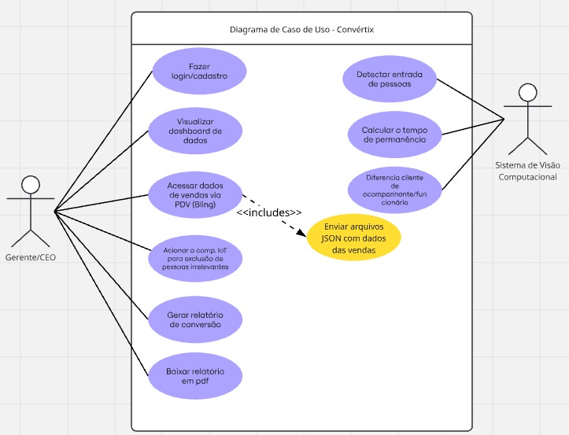

# Olá, esse é o Convértix! Seja bem-vindo(a)!

# 🔗 Convértix - Links do Projeto

* [Protótipo - Figma](https://www.figma.com/design/IriABbFDNDlawMb4gZRF73/Conv%C3%A9rtix-Prot%C3%B3tipo?node-id=0-1&p=f&t=TPMEZJYjKiPj263a-0)
* [Trello](https://trello.com/b/nGhNq450/kanban-conv%C3%A9rtix)
* [Repositório (Privado)](https://github.com/Nataliab-16/Convertix)

## 👥 Integrantes do Projeto

*Natália de Lima Brandão*  
*Karolaine Pinz Maia*  

# 🔄 Sobre o Convértix

## ❓ Justificativa 
O varejo enfrenta desafios significativos na gestão do desempenho de vendas e na experiência do cliente.
 
__Algumas das principais dificuldades incluem:__
- Falta de dados precisos sobre a entrada de clientes
- Dificuldade em avaliar o desempenho de vendedores
- Falta de indicadores de desempenho para decisões estratégicas

A justificativa deste estudo está atrelada à necessidade de melhorar o desempenho do varejo, que enfrenta desafios cada vez maiores na gestão de vendas e no atendimento ao cliente. No cenário atual, muitas lojas têm dificuldades em coletar dados precisos sobre a entrada de clientes e, consequentemente, sobre a taxa de conversão (proporção de visitantes que se tornam compradores). Isso impede que as empresas otimizem suas operações e melhorem suas estratégias de vendas de forma eficiente e a solução proposta, visa suprir essa lacuna.

__Vantagens para o varejo:__
- Melhoria na tomada de decisões estratégicas, uma vez que os gestores terão acesso a dados claros e objetivos sobre a taxa de conversão, o desempenho dos vendedores e a performance de vendas por períodos.

- Otimização de estoques e campanhas promocionais com base em dados precisos e atualizados, garantindo que as lojas possam ajustar suas estratégias para o aumento do faturamento.

Portanto, este projeto se justifica pela necessidade de inovação no varejo, oferecendo uma solução tecnológica que melhora o processo de gestão de vendas, contribui para o aumento da taxa de conversão e permite uma melhor análise de desempenho das lojas e equipes de vendas.

## :dart: Objetivos do Sistema
### Objetivo Geral
Desenvolver, implementar e validar um sistema baseado em visão computacional para monitoramento do fluxo de clientes em lojas físicas, integrado à plataformas de gestão de vendas, com o objetivo de mensurar taxas de conversão e desempenho de equipes comerciais, promovendo a transformação digital no varejo e gerando conhecimento aplicado sobre o uso de inteligência artificial nesse contexto.
### Objetivos Específicos
Desenvolver um módulo de visão computacional utilizando modelos como YOLOv6 ¹ ou YOLOv7 ², capaz de identificar, diferenciar e contabilizar automaticamente a entrada de clientes em estabelecimentos comerciais.

1. Integrar o sistema ao PDV Bling para ingestão e análise dos dados de vendas em tempo real, viabilizando o cálculo automatizado da taxa de conversão por período.

2. Criar mecanismos para exclusão automática de dados de acompanhantes, funcionários e prestadores de serviço, a fim de refinar os indicadores de desempenho e evitar ruído estatístico.

3. Projetar uma interface de dashboard acessível via navegador e dispositivos móveis, que permita ao gestor gerar relatórios periódicos (diário, mensal e anual) e visualizar informações como taxa de conversão, volume de vendas e desempenho individual das vendedoras.

4. Realizar testes em ambiente real (lojas piloto), avaliando o impacto do sistema nas operações de venda, eficiência das equipes, planejamento de estoque e faturamento.

5. Avaliar o desempenho do sistema em termos de acurácia, tempo de resposta e capacidade de generalização, contribuindo para a validação científica de modelos de detecção em ambientes não controlados.

6. Analisar a viabilidade econômica e modelos de monetização da solução (licenciamento ou assinatura), considerando a escalabilidade para micro, pequenas e médias empresas do setor varejista.

## 📊 Análise de mercado
A proposta do sistema combina análise de conversão de vendas via dashboard e reconhecimento de pessoas via visão computacional. Compararemos com os concorrentes: (FootfallCam e VTrack) e identificaremos os principais diferenciais.

### 1. Mercado-Alvo e Necessidade do Cliente
__Público-alvo__
- Lojas de varejo que buscam aumentar sua taxa de conversão de vendas.
- Gerentes e CEOs interessados em dados estratégicos para treinamento de vendedores e otimização do atendimento.
- Empresas que desejam dados precisos e personalizados sem depender apenas de soluções globais como a FootfallCam.

__Principais dores do mercado__
 - Falta de precisão nos dados sobre quantos clientes realmente compram.
- Dificuldade em separar clientes reais de acompanhantes, funcionários e prestadores de serviço.
- Ferramentas caras e complexas de implementar, sem integração nativa com PDVs comuns.

### 2. Comparação com Concorrentes
__FootfallCam (Malásia)__

✅ Conta clientes e analisa fluxo de entrada e saída.

✅ Gera taxa de conversão baseada em compras.

⚠️ Foco global, pode não ter suporte e integração ideais para o mercado brasileiro.

⚠️ Não diferencia acompanhantes de clientes compradores.

__VTrack (Brasil)__

✅ Visão computacional para análise de fluxo de clientes.

✅ Relatórios sobre performance de vendas e equipe.

⚠️ Solução voltada para fluxo de clientes, mas sem um sistema avançado de exclusão de dados irrelevantes.

⚠️ Sem integração documentada com PDVs específicos.

### 3. Diferenciais do Nosso Sistema

✅ 1. Separação Inteligente de Clientes e Acompanhantes
Diferente dos concorrentes, excluímos acompanhantes não compradores, melhorando a precisão da taxa de conversão. Filtramos funcionários, fornecedores e ambulantes com um componente IoT acionado pelas vendedoras.

✅ 2. Processamento Pós-Horário Comercial
Ao contrário das soluções que processam em tempo real, nosso sistema analisa os dados após o expediente, evitando consumo excessivo de recursos e priorizando eficiência.

✅ 3. Integração Nativa com PDV Bling
Recebemos dados diretamente do Bling via arquivos CSV, tornando a integração mais fácil para empresas que já utilizam esse PDV.

✅ 4. Dashboard Completo e Personalizado
Além de mostrar número de clientes e taxa de conversão, o relatório pode ser filtrado por semana, mês, ano e vendedoras. Com geração de relatórios em PDF para download.

✅ 5. Precisão 
Utilizamos YOLOv6 ou YOLOv7, garantindo 90%+ de precisão.

✅ 6. Privacidade
Anonimizamos os dados, focando apenas em estatísticas, cumprindo leis de privacidade.

✅ 7. Segurança
Autenticação multifator (MFA) para acesso gerencial.

## ⛏️ Funcionalidades - User stories
### Dashboard de dados
Como CEO ou gerente
Eu quero analisar os dados de conversão de vendas por semana, mês ou ano
Para utilizar estas informações como maneira de alavancar minha estratégia e treinamento das vendedoras.

__Que dados serão estes?__
- Entrada de clientes total
- Vendas totais realizadas
- Taxa de conversão 
(A partir de filtros por período)

__Como os dados funcionarão nessa dashboard?__
- Após o fim do horário comercial o gerente deve buscar a opção "gerar relatório" dos dias desejados, e os mesmos são registrados na dashboard estando disponíveis para download em pdf

### Reconhecimento de pessoas
Eu como CEO ou gerente 
Preciso que uma câmera reconheça a entrada de pessoas em minha loja 
Para integrar com meu sistema PDV e levantar os dados que preciso. 

__Como isso será feito?__
Através de modelos como YOLOv6 ou YOLOv7 inicialmente para reconhecimento das pessoas 
O algoritmo reconhecerá pessoas que entraram na loja em três casos:
1. Reconhece diretamente uma criança acompanhada do responsável e a exclui do algoritmo.
2. Reconhece uma pessoa. (Calcula tempo de permanência)
3. Reconhece duas pessoas, gerando um registro do tempo de permanência em loja, e no momento que essas pessoas saem o registro é finalizado e analisado então quantas compras foram realizadas naquele período para essas pessoas
*EX: Marido acompanha a esposa às compras, porém apenas ela é a compradora. Logo o sistema descarta o acompanhante do levantamento de dados.*

## 💸 Monetização
### Assinatura Mensal
Modelo baseado em planos mensais, cobrando pelo uso do sistema conforme o porte da loja e quantidade de dados processados.
__Exemplos de planos:__
- Plano Básico: Até 500 entradas de clientes por mês + relatórios básicos.
- Plano Intermediário: Até 2.000 entradas por mês + integração com Bling e relatórios avançados.
- Plano Avançado: Dados ilimitados + dashboards personalizados + suporte premium.
### Venda do Sistema como Licença
Modelo onde o sistema é vendido como um software único, com possibilidade de personalização para grandes redes varejistas.

# 🛠️ Requisitos do Sistema
## Funcionais
- RF01: O usuário deverá realizar um cadastro/login. 
O usuário informará nome, e-mail, senha e confirmação da senha. Sendo todos estes obrigatórios. 
- RF02: O sistema deve ser capaz de reconhecer a entrada de pessoas na loja através de uma câmera integrada.
- RF03: O modelo de reconhecimento deve identificar e diferenciar indivíduos dentro da loja.
- RF04: O sistema deve vincular as compras realizadas no período de permanência para calcular a taxa de conversão correta.
- RF05: O sistema não deve contabilizar pessoas que já trabalham lá e o fluxo delas de entrada e saída do local para o levantamento de dados.
- RF06: O sistema deve permitir a geração de relatórios de conversão de vendas por período (semana, mês ou ano) e vendedoras.
- RF07: Acompanhantes de clientes devem ser excluídos do registro.
- RF08: Ao entrar em loja servidores como: Distribuidor de água mineral, faxineira, vendedores ambulantes e fornecedores, as vendedoras acionarão um componente IoT para que este capte os últimos 20 segundos (time stamp) em que a pessoa entrou na loja e grave os dados de horário em um banco de dados para ser ignorada dos registros. 
- RF09: Acessar dados das vendas por integração com o sistema PDV bling, onde por meio deste receberemos arquivos csv para manipulação.
- RF10: A dashboard deve disponibilizar os relatórios para download em PDF.
- RF11: A geração do relatório deve ser feita manualmente pelo gerente através da opção "Gerar Relatório".
- RF12: O gerente deve poder acessar os dados de entrada total de clientes, vendas totais realizadas e taxa de conversão.

## Não funcionais
__Desempenho e Escalabilidade__
- RNF01: A dashboard deve exibir os dados em até 10 segundos após a geração do relatório.
- RNF02: O sistema de reconhecimento de pessoas deve ter uma precisão mínima de 90% na detecção e categorização de clientes.
- RNF03: O processamento do reconhecimento deve ocorrer após o expediente 
- RNF04: O sistema deve ser capaz de processar múltiplas entradas e saídas simultaneamente.

__Segurança e Privacidade__
- RNF05: O sistema deve armazenar apenas os dados estatísticos anonimizados, sem registros de identidade dos clientes.
- RNF06: O acesso à dashboard deve ser protegido por autenticação de múltiplos fatores para gerentes e CEOs.

__Tecnologia e Integração__
- RNF07: O sistema de reconhecimento de pessoas deve utilizar modelos como YOLOv6 ou YOLOv7 para detecção.
- RNF08: A dashboard deve ser acessível via navegador web e compatível com dispositivos móveis.
- RNF9: O relatório em PDF deve ser gerado automaticamente a partir dos dados do dashboard.
- RNF10: O sistema deve ser compatível com integração ao PDV para correlacionar os dados de entrada com as compras realizadas.

# 📆 Cronograma
{width=499 height=468}

# ⚙️​ Tecnologias 
|  Área                  | Tecnologia               | Função                                           |
| -----------------------| -------------------------| -------------------------------------------------|
| Front-end              | Next.js + Bootstrap      | Interface web responsiva                         |
| Back-end               | Express.js + Prisma      | API de controle de usuários, autenticação...     |
| Banco de dados         | Neon (PostgreSQL)        | Banco de dados relacional                        |
| Visão Computacional    | Tensorflow + Yolo + Flask| API dedicada para detecção facial                |
| Autenticação           | JWT                      | Sistema seguro de login e sessão                 |
| Criptografia           | bcrypt                   | Hash seguro de senhas de usuários                |
| Funções Escaláveis     | AWS Lambda               | Executar geração de relatórios                   |
| Base de dados          | API Bling                | Coletar dados das vendedoras e vendas            |

# 🗒️​ Diagrama de classes

# 🗒️​ Diagrama de casos de uso
{width=660 height=450}

# 🔍 Estado da arte
A integração de visão computacional com sistemas de gestão comercial representa um avanço significativo no monitoramento de desempenho em pontos de venda físicos. Nos últimos anos, diversas pesquisas e aplicações têm demonstrado o potencial da visão computacional para contabilizar o fluxo de pessoas, identificar padrões de comportamento e cruzar esses dados com indicadores de desempenho comercial.

**Visão Computacional no Varejo**
Soluções baseadas em visão computacional têm sido amplamente exploradas no varejo para fins como contagem de clientes, análise de calor (heatmaps), reconhecimento facial e rastreamento de comportamento. Segundo Silva et al. (2021), algoritmos como YOLO (You Only Look Once) e OpenPose vêm sendo aplicados com alta precisão na detecção e acompanhamento de pessoas em tempo real. Essas tecnologias permitem uma análise mais acurada do fluxo de entrada de clientes em lojas físicas, oferecendo dados que antes dependiam exclusivamente de sensores ou anotações manuais.

**Taxa de Conversão e Desempenho de Vendedores**
A medição da taxa de conversão – proporção entre clientes que entram na loja e os que realizam uma compra – é um dos indicadores mais valiosos para o varejo. Pesquisas como a de Almeida e Rocha (2020) destacam que o cruzamento de dados de entrada de clientes com o número de vendas pode oferecer insights profundos sobre a efetividade das estratégias comerciais e a atuação da equipe de vendas. Além disso, sistemas que identificam o vendedor responsável pela finalização da venda possibilitam uma avaliação individual mais precisa, promovendo a meritocracia e a melhoria contínua do desempenho.

**Integração com Sistemas de ERP**
Com a crescente digitalização das operações comerciais, sistemas ERP como o Bling têm sido amplamente utilizados por micro e pequenas empresas para controlar estoques, emitir notas fiscais e gerenciar vendas. Estudos recentes, como os de Costa et al. (2022), mostram que a integração entre sistemas inteligentes de monitoramento e ERPs pode automatizar a geração de relatórios gerenciais, otimizando a tomada de decisões. A sincronização dos dados permite acompanhar em tempo real o desempenho de cada colaborador e as tendências de vendas, por dia, mês ou ano.

**Desafios e Lacunas Identificadas**

Apesar dos avanços, ainda existem desafios importantes. Muitos sistemas de visão computacional carecem de precisão em ambientes com iluminação variável ou grande movimentação. Além disso, a integração de dados entre plataformas distintas (como sistemas de câmeras e ERPs) requer protocolos padronizados e segurança na transmissão das informações. Outra lacuna é a personalização dos relatórios para que reflitam de forma clara os indicadores mais relevantes para o negócio.
Dessa forma, observa-se a necessidade de soluções mais acessíveis, automatizadas e com alta acurácia que integrem monitoramento inteligente e análise de performance comercial. A proposta deste trabalho se insere nesse contexto, buscando contribuir com uma abordagem inovadora e aplicável especialmente a pequenos e médios negócios do varejo.

